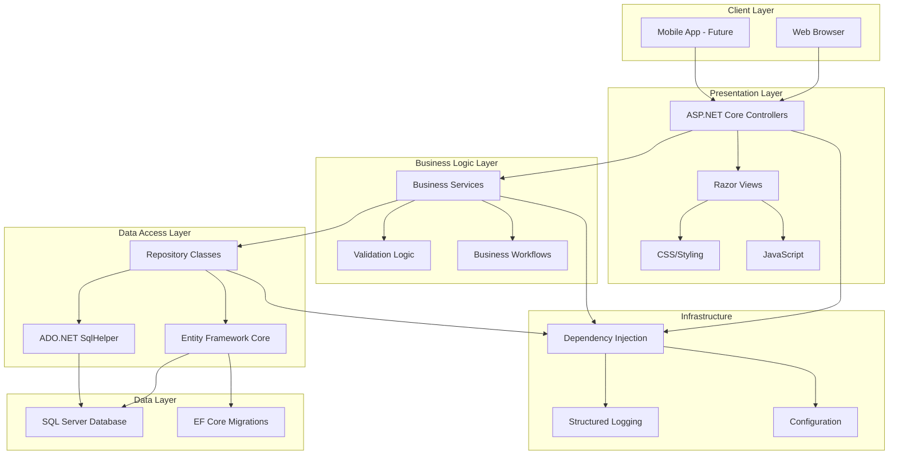
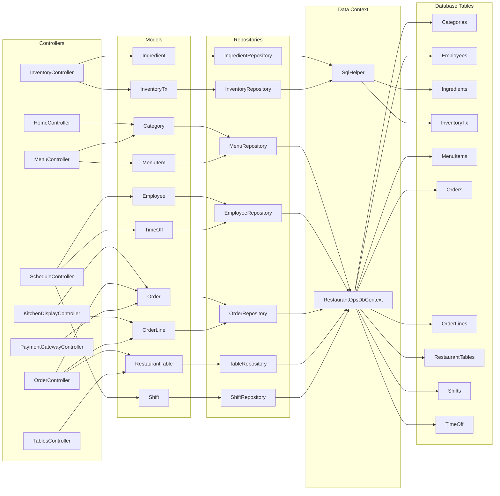
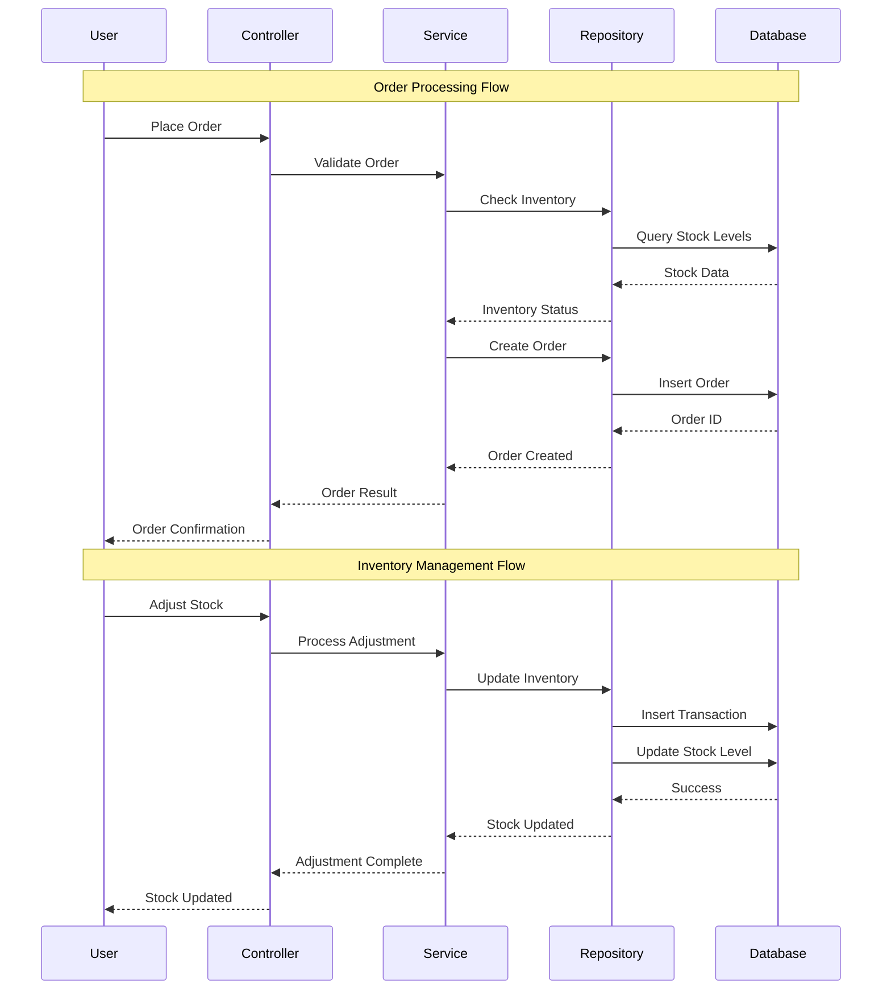
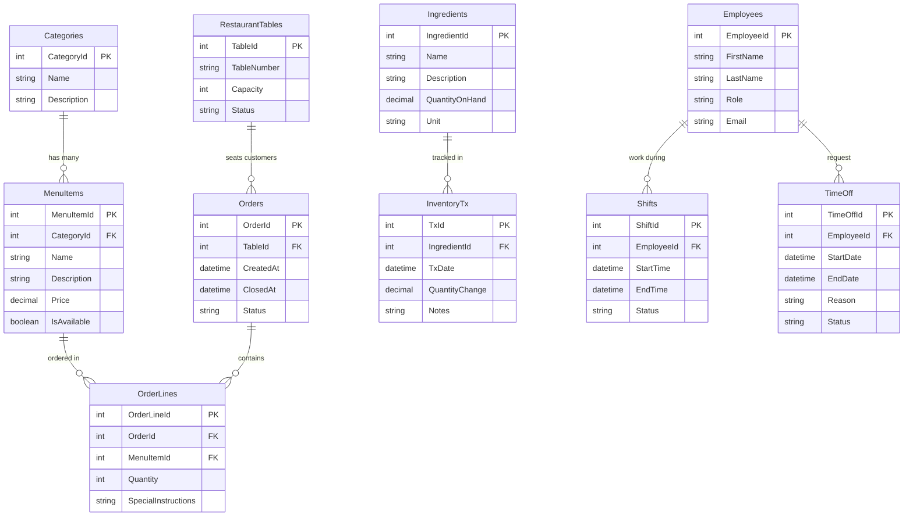
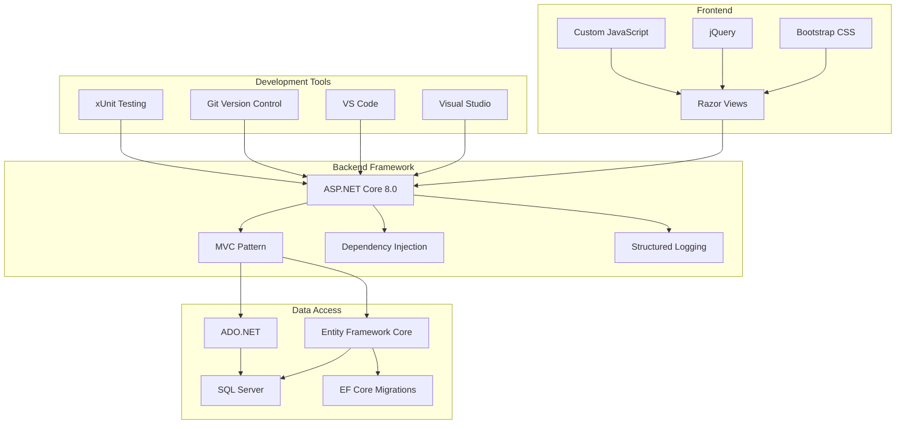
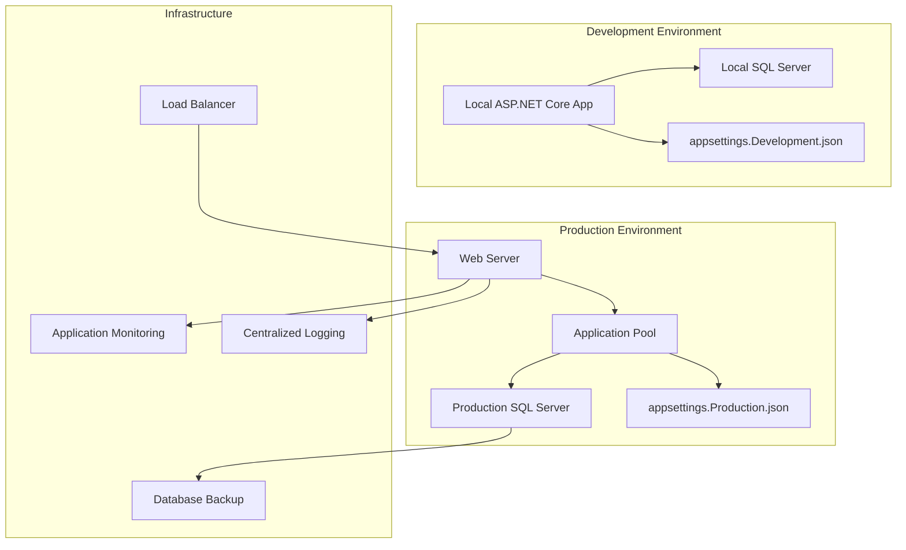

# RestaurantOps System Architecture

## High-Level System Overview

## Detailed Component Architecture

## Data Flow Architecture

## Database Schema Relationships

## Technology Stack

## Deployment Architecture

## Key Architectural Decisions

### 1. Hybrid Data Access
- **Entity Framework Core**: For new development and complex queries
- **ADO.NET**: For legacy operations and performance-critical queries
- **Repository Pattern**: Abstracts data access implementation details

### 2. Layered Architecture
- **Presentation Layer**: Controllers and Views
- **Business Logic Layer**: Services and validators
- **Data Access Layer**: Repositories and data context
- **Data Layer**: SQL Server database

### 3. Dependency Injection
- **Service Registration**: Configured in Program.cs
- **Constructor Injection**: Used throughout the application
- **Interface-based Design**: Enables testing and flexibility

### 4. Configuration Management
- **Environment-specific**: Separate configs for dev/prod
- **User Secrets**: Secure configuration during development
- **Environment Variables**: Production configuration override

### 5. Testing Strategy
- **Unit Tests**: Isolated component testing
- **Integration Tests**: Database and service integration
- **Test Builders**: Consistent test data construction
